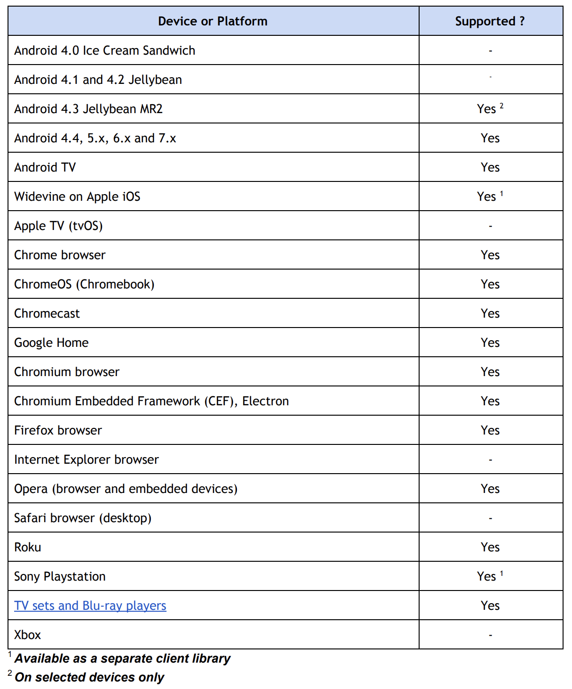
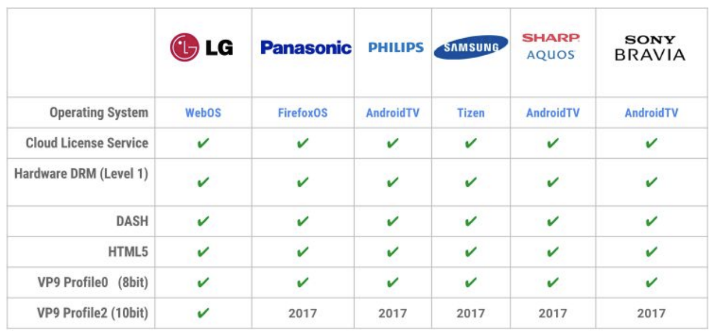
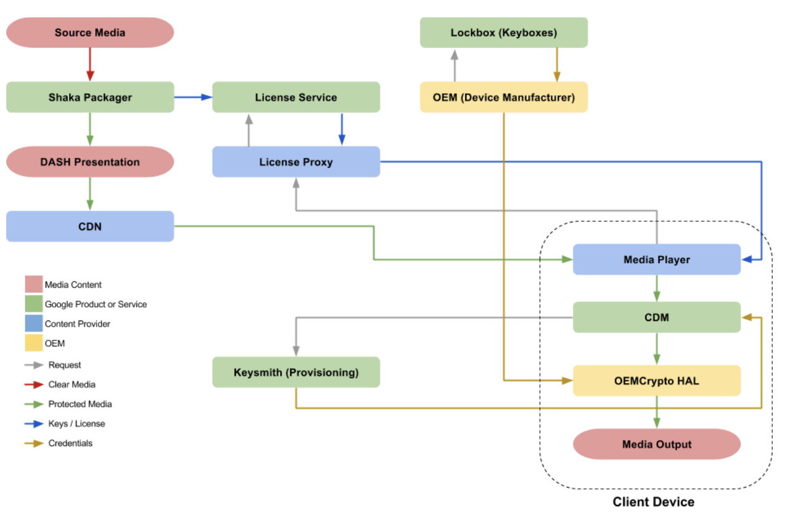

 ## Google’s Widevine 

* [가이드문서](https://storage.googleapis.com/wvdocs/Widevine_DRM_Getting_Started.pdf)
* 아래 내용은 가이드 문서 정리/추가 한 내용임
  
### 지원 플렛폼
  
  

* 보안레벨[^3] L1를 만족해야 넷플릭스 같이 HD 컨텐츠 스트리밍 가능. 안드로이드의 경우 하드웨어나 소프트웨어 구현에 따라 L1이나 L3를 만족함. 기기가 L3를 만족할때는 하위 HD해상도로 제한됨
  
* 라이센스 및 서비스 사용 무료

### 구성
  

* The Lockbox, Keysmith, OEMCrypto는 실기기에 필요한 요소
* Key system의 경우 Widevine, PlayReady, FairPlay, Marlin 호환됨
* Widevine Cloud License Service
    *  단체에서만 사용 가능. 자격증명의 경우 문의 필요.
    * 라이센싱 서비스는 테스트/실서버로 구분되어 있음.
        * 테스트:  https://license.uat.widevine.com
        * 실서버:  https://license.widevine.com
    * 실서버에서 250qps이상 사용하기위해서는 구글에 문의 필요
    * 업체끼지 않고 라이센싱 바로 사용 할 경우 교육 및 자격이 필요함(시험도 봐야함)
        *  You can contract with one of our Certified Widevine Implementation Partners [ CWIP's] or become a CWIP and be  trained and certified on the WV software to be able to install, integrate, and support the Software yourselves instead of hiring a 3rd party to provide those services.

    * [자격관련안내](../res/CWIP_Program_2018.pdf)

* Contents Encryption
    * API는 단체별 고유한 서명필드를 사용해야함

* [raw키로 가능](https://google.github.io/shaka-packager/html/tutorials/raw_key.html)
    * Shaka Packager supports raw keys, for which keys and key_ids are provided to Shaka Packager directly.This is often used if you are managing the encryption keys yourself. It also allows you to support multi-DRM by providing custom PSSHs.
    * raw키로 암호화 한 mp4파일 로컬 재생시 라이센스 서버 없이 Android exoplayer2 - LocalMediaDrmCallback활용하여 재생되는 것 확인.
        * 키관리 어떻게할지 확인 필요 

* 라이센스 서버 없이 > ClearKey 사용 시 알맞은 key,keyID넣어주면 exoplayerDRM 작동함.

### EncodingPackaging

* Widevine 지원 패키징 툴은 Shaka Packager
* [도커로 설치 가능](https://github.com/google/shaka-packager/blob/master/docs/source/docker_instructions.md)
  
* [indexnext |Shaka Packager documentation](https://google.github.io/shaka-packager/html/index.html)
* FFmpeg 파이프라이닝 가능

* [Common Encryption API](https://storage.googleapis.com/wvdocs/Widevine_DRM_Encryption_API.pdf)
* [인코딩/패키징 문서](https://storage.googleapis.com/wvdocs/Widevine_DRM_Encoding_and_Packaging.pdf)

### Client
* Android
    * ExpoPlayer 추천
    * 현재 서비스 중인 플레이어의 경우 기본 플레이어로 drm구현시 플레이어 새로 만들어아햠
    * ExoPlayer 사용 시 mpd 재생 되는 것 확인
  
* Browser
    * Shaka Player 제공 (open-source)
    * [튜토리얼](https://shaka-player-demo.appspot.com/docs/api/index.html)

* 각주
  - [^3]: 보안레벨 1을 충족하기 위해서는 장치의 프로세서의 TEE (Trusted Execution Environment) 내에서 모든 콘텐츠 처리, 암호화 및 제어를 수행하여 미디어 파일의 외부 변조 및 복사를 방지해야 함(HW단 보안). 보안레벨 2는 TEE 내에서 암호화를 처리하지만 비디오 처리는 수행하지 않음. L3은 장치에 TEE가 없거나 처리가 외부에서 수행 될 때 적용